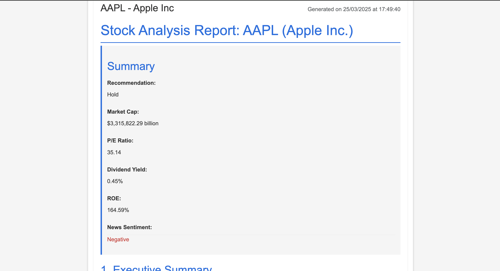
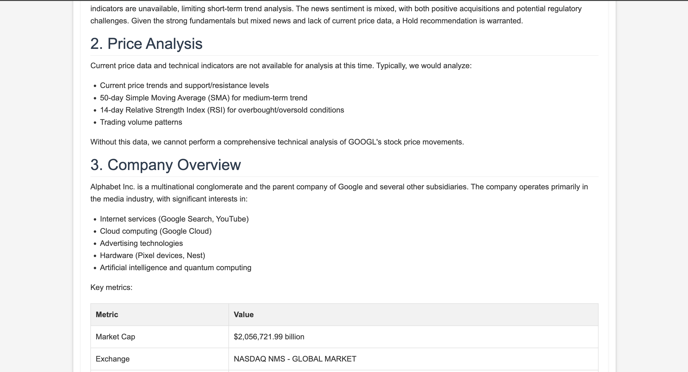
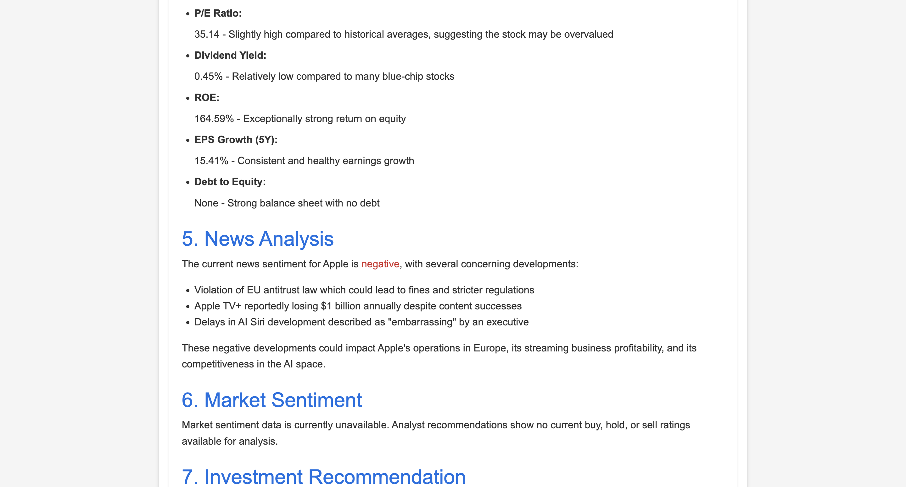
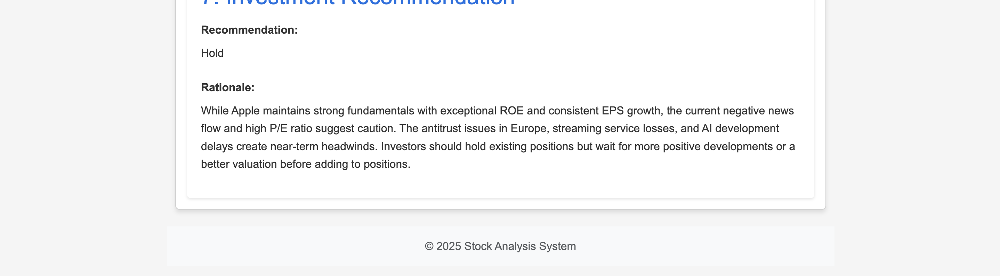

## Renaissance Stock
Your personal full time analyst 
#### What is Renaissance Stock
Renaissance Stock is an agentic framework that generates stock analysis reports using up-to-date information. It is significantly faster and more cost-effective than traditional methods. Most importantly, it’s open source, allowing anyone to use it without restrictions.


#### How to use ?
Step 1: Installation
```bash
 pip install -r requirements.txt
```

Step 2: Create Enviroment File
```bash 
torch .env
```

Step 3: Fill in the following information in .env
```
OPENAI_API_KEY=deepseek_API 
ALPHA_VANTAGE_API_KEY=your_alpha_vantage_api_key
NEWS_API_KEY=your_news_api_key
FINNHUB_API_KEY=your_finnhub_api_key
PORT=5000
DEBUG=False
```

Step 4: Enjoy
```bash
python app.py
``` 

#### Example Images

Here are some examples of the images:






#### Contributors
@JasonHonKL

#### LICENSE 
MIT LICENSE 

#### CONTRIBUTION 
We welcome any pull requrests. But it takes time to review so please wait. 
