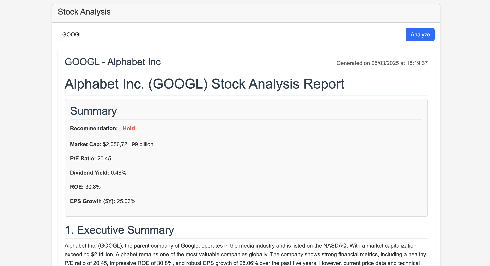
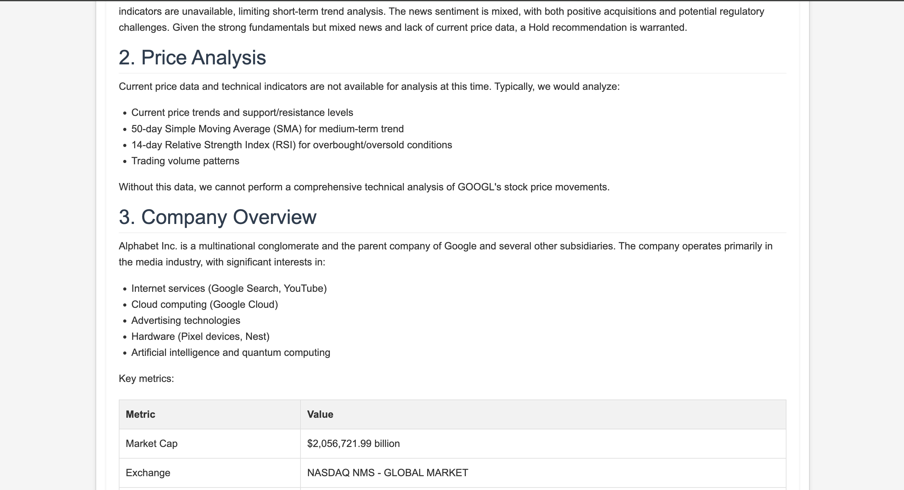
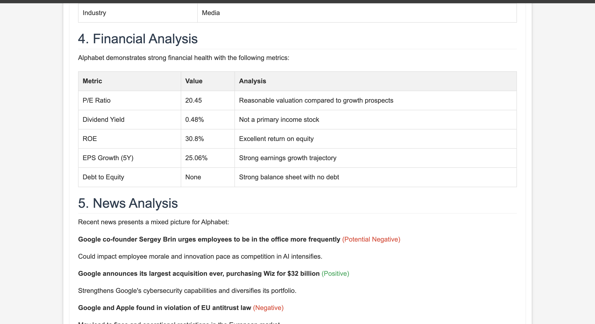
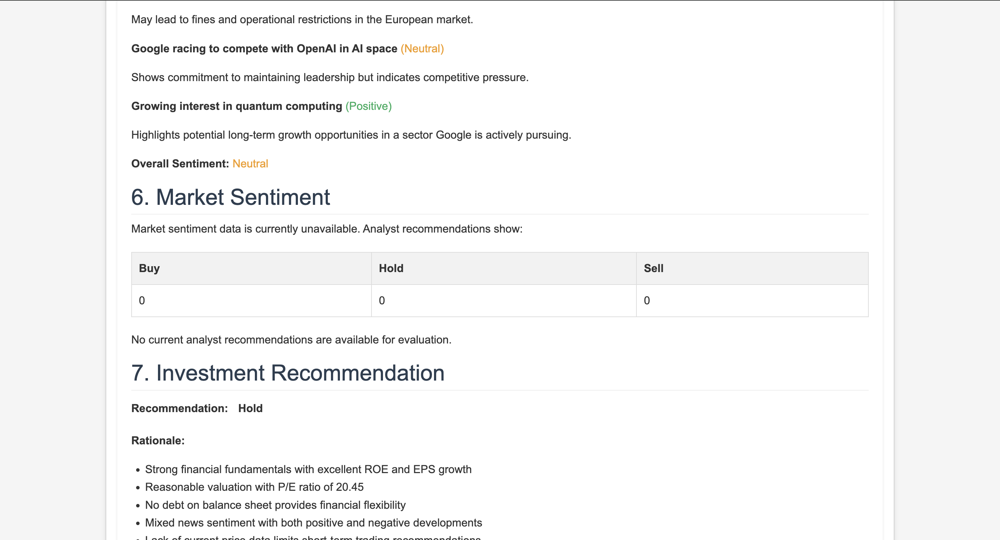
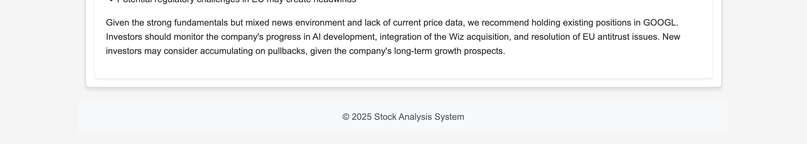

# Renaissance Stock

## Your Personal Full-Time Analyst

⭐ **We love stars! If you enjoy our project, please give us a star!** ⭐

---

## What is Renaissance Stock?

**Renaissance Stock** is a powerful, agentic framework designed to generate comprehensive stock analysis reports using the latest market data. Our solution is not only faster and more cost-effective than traditional analysis methods, but it’s also open-source, empowering anyone to utilize it without any restrictions.

---

## Features

- **Real-Time Data Analysis**: Access up-to-date information for informed decision-making.
- **Cost-Effective**: Save time and resources compared to conventional methods.
- **Open Source**: Contribute and modify the codebase freely.
- **User-Friendly**: Simple setup and easy to use.

---

## Getting Started

### Step 1: Installation

To get started, clone the repository and install the required packages:

```bash
pip install -r requirements.txt
```

### Step 2: Create Environment File

Create an environment file to store your API keys:

```bash
torch .env
```

### Step 3: Configure Your Environment

Open the `.env` file and fill in your API keys:

```
OPENAI_API_KEY=your_open_ai_key
ALPHA_VANTAGE_API_KEY=your_alpha_vantage_api_key
NEWS_API_KEY=your_news_api_key
FINNHUB_API_KEY=your_finnhub_api_key
PORT=5000
DEBUG=False
BASE_URL=the_base_url_of_your_provider
MODEL=the_model_you_use
```

### API Key Sources

- **[Alpha Vantage API](https://www.alphavantage.co/support/#api-key)**: Sign up for a free API key to access stock market data.
- **[News API](https://newsapi.org/register)**: Register for an API key to access news articles from various sources.
- **[Finnhub API](https://finnhub.io/docs/api#authentication)**: Create an account to obtain your API key for financial data.

### Step 4: Run the Application

Once everything is set up, enjoy your personalized stock analysis:

```bash
python app.py
```

---

## Example Outputs

Here are some examples of the stock analysis reports generated by Renaissance Stock:







---

## Contributors

We'd like to thank our amazing contributors for their hard work and dedication:

- [@JasonHonKL](https://github.com/JasonHonKL)
- [@Tianzhe Chu](https://github.com/LeslieTrue)
- [@KinsonAu03](https://github.com/KinsonAu03)
- [@BrianaaaC](https://github.com/BrianaaaC)

---

## License

This project is licensed under the [MIT License](LICENSE).

---

## Contribution

We welcome contributions! Feel free to submit pull requests. Please note that review times may vary, so thank you for your patience.

---

Thank you for choosing Renaissance Stock for your stock analysis needs! Happy investing! 🚀
